狐蒂云暴雷深度复盘：从“永久VPS”神话到一夜跑路，数万用户血本无归的真相

2026年5月7日，一场突如其来的“服务器离线”，打破了数万用户对“永久服务”的幻想——国内IDC服务商狐蒂云（深圳市狐蒂云网络科技有限公司）正式宣告倒闭跑路，CEO许跃滨（网名“小胖狐”）深夜发文自爆资金链断裂，数小时内，国内外所有服务器全线下线，用户数据无法备份、退款申请石沉大海、客服全员失联。这场看似仓促的暴雷，实则是一场酝酿已久的“低价陷阱”，背后是商家的贪婪、行业的内卷，以及无数用户的血泪损失。本文将全面复盘整个事件的来龙去脉，拆解暴雷真相、梳理用户损失、剖析行业痛点，为所有互联网从业者、个人站长、小型企业敲响警钟。

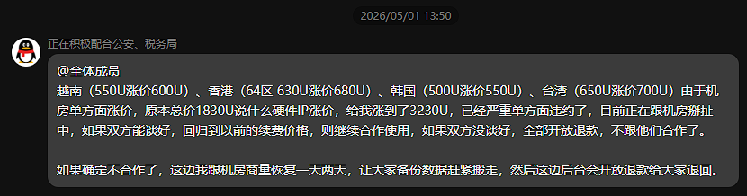

## 一、事件背景：狐蒂云是谁？“永久VPS”的神话如何崛起？

狐蒂云成立于2024年，注册地为深圳市，主营业务为IDC服务，涵盖VPS服务器、虚拟主机、独立服务器、域名注册等，主打“高性价比”标签，凭借“永久VPS\+三年质保”的核心套餐迅速在IDC行业崭露头角，短短两年内积累了数万用户，其中以个人站长、独立开发者、小型企业为主。

狐蒂云的崛起，完全依赖于极具诱惑力的低价宣传，其核心推广套餐——1999元永久VPS，成为吸引用户的“杀手锏”。在行业普遍推行“年付、季付”的当下，狐蒂云高调宣称“一次付费，终身使用”，不仅承诺三年质保期内免费更换硬件、维护网络、提供技术支持，甚至宣称质保期满后仍可享受免费性能优化、灾难备份等增值服务，同时推出“意外停机立即提供替补机器”的保障，彻底击中了用户“贪便宜、求稳定”的心理。

为了扩大影响力，狐蒂云还在B站、抖音、博客园、4414站长论坛等平台大量投放广告，邀请自媒体博主推广，营造“性价比之王”“中小用户首选IDC服务商”的形象，甚至开设二手主机交易市场，允许用户转售、转租已购买的VPS，进一步吸引用户入局，形成“低价引流→用户付费→二手交易”的虚假繁荣闭环。

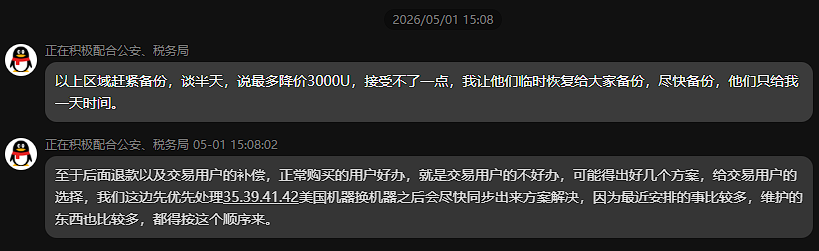

## 二、事件时间线：从预警信号到全面崩盘，24小时内的致命崩塌

狐蒂云的暴雷并非毫无征兆，从5月6日的异常停摆，到5月7日的全面跑路，短短24小时，一场精心掩盖的运营危机彻底爆发，留给用户的只有猝不及防的损失。以下是事件完整时间线，精准还原每一个关键节点：
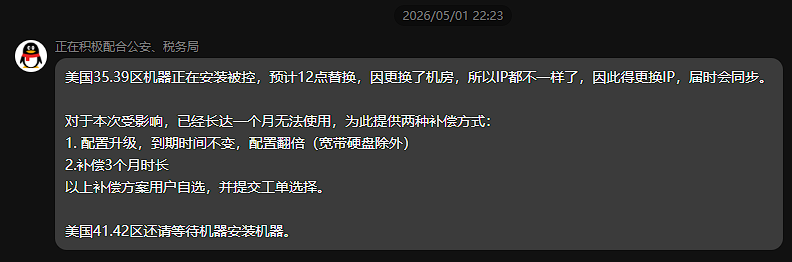

### （一）5月6日：前兆显现，停摆信号已现

11:06，狐蒂云官网突然发布公告，明确表示“旧版主机市场停止运营”，关闭所有主机交易、续费、升级功能，仅保留余额提现、余额转入两个入口。公告中未说明停摆原因，仅提示“请用户妥善保管个人资产，合理安排业务”。

这一公告瞬间引发用户恐慌，因为早在公告发布前，就有大量用户反馈“二手主机市场提现不到账”，部分用户提现申请已提交超过一年，始终处于“审核中”状态，此次旧版市场停摆，意味着二手交易资金彻底被冻结，用户的提现希望彻底破灭。

晚间19:00后，更多异常出现：部分用户反映自己的VPS服务器出现卡顿、丢包现象，部分海外节点无法正常连接；用户群内咨询客服，客服回复延迟严重，甚至出现“自动回复”敷衍了事的情况；有用户尝试联系CEO许跃滨，其个人微信、QQ均无回应，核心用户群开始出现“平台要跑路”的猜测，但未得到官方任何回应。

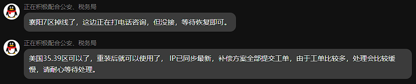

### （二）5月7日：全面爆发，一夜之间彻底跑路

00:00–02:00，数万狐蒂云用户同时收到一条短信，短信内容简洁而冰冷：“我方运营终止，请尽快自行做好服务器数据备份，避免损失；相关账户可依法追偿。” 短信未留下任何联系方式，也未说明具体的退款、数据备份流程，此时，已有部分用户发现自己的服务器无法登录，SSH连接失败、控制台无法打开。

02:00起，危机全面升级：狐蒂云国内外所有节点服务器批量离线，无论是国内的北京、上海、广州节点，还是海外的香港、美国、新加坡节点，均无法连通；用户尝试通过各种方式备份数据，均以失败告终，大量用户的网站、项目、数据库直接瘫痪，多年心血面临灭失风险。

04:51，CEO许跃滨在狐蒂云核心用户群发长文“坦白局”，这也是他最后一次公开发声，文中毫无掩饰地承认了平台的绝境，核心内容如下：
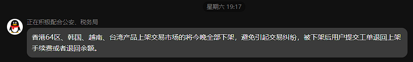
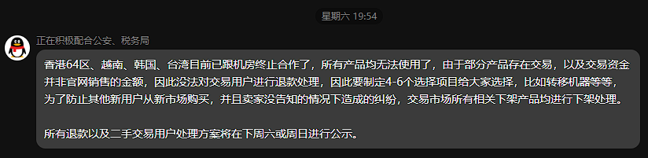
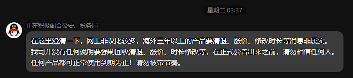

- 平台已持续亏损近一年，核心原因是“长期补贴永久VPS套餐”，所有盈利全部投入补贴，后期收入无法覆盖成本，最终资金耗尽，账上无任何流动资金；

- 所有用户可尽快提交退款申请，平台会按提交顺序登记处理，但明确表示“目前没钱可退，需要长期等待，具体到账时间无法确定”；

- 已与合作机房协商，承诺“到期服务器延期备份”，但实际情况是，机房已因拖欠租金强制断机，所有服务器均已离线，无法登录备份；

- 本人已无能力继续运营平台，后续将“打工还债”，平台彻底停摆，无任何重启计划，对所有用户表示“抱歉”。

08:00–18:00，用户恐慌达到顶峰：狐蒂云官网可访问，但仅显示空白页面，无任何新公告、无任何服务入口；客服QQ、微信群、工单系统全部失联，核心用户群被禁言，普通用户群无人管理；B站、抖音、博客园、知乎等平台，大量用户发布爆料视频、文章，分享自己的损失，\#狐蒂云跑路\# \#狐蒂云服务器离线\# 等话题快速扩散，相关话题阅读量短时间内突破百万，无数用户自发组建维权群，统计损失、商议维权方案。

晚间20:00后，更多残酷真相被曝光：有用户查询工商信息发现，狐蒂云已处于“经营异常”状态，注册地址为空，无实际办公场地；有内部人士爆料，平台存在严重超售现象，一台物理服务器（母鸡）违规开设200\+台虚拟机，远超正常承载能力，这也是此前服务器频繁卡顿、宕机的核心原因；同时，二手主机市场的交易资金被大量挪用，用于补贴永久套餐的亏损和CEO个人挥霍。

### （三）5月8日及以后：全面停摆，维权无门的绝境

5月8日，狐蒂云彻底沦为“空壳”：官网域名虽未过期，但仅显示空白页面，无任何有效信息；国内外所有服务器全部“失联”，无论是Ping测试还是端口扫描，均无任何响应，用户数据彻底无法备份，成为永久损失；客服、运营、技术人员全部失联，QQ、微信、电话均无人接听，此前承诺的“退款登记”也无任何入口，用户提交的退款申请石沉大海。

此后数日，用户的维权之路陷入僵局：大量用户前往当地派出所报警，提交相关证据，但警方表示，狐蒂云为小微企业，无固定资产、无办公场地、无资金储备，无法立案侦查或执行财产；部分用户尝试联合起诉，但用户分散在全国各地，组织难度大，且法律流程漫长，即便胜诉，也无财产可执行；有用户尝试联系机房，机房表示“已拖欠数月租金，已强制断机，不负责用户数据备份和退款”。
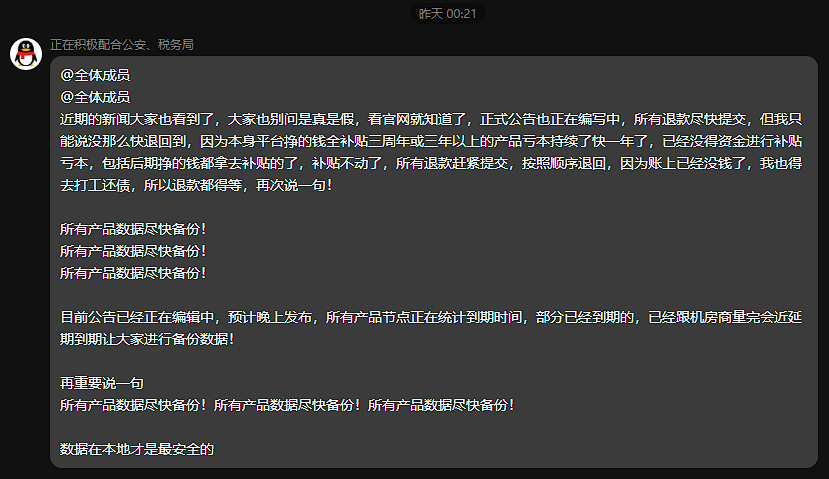

截至目前，狐蒂云暴雷已过去多日，仍无任何退款到账案例，CEO许跃滨彻底失联，用户的资金和数据全部损失，维权之路举步维艰。

## 三、暴雷根源深度剖析：低价神话的背后，是自杀式运营的必然

狐蒂云的暴雷，绝非偶然，而是“低价陷阱\+违规运营\+行业内卷”共同作用的结果。表面上看，是资金链断裂导致的倒闭，但深层次来看，是商家违背商业逻辑的自杀式运营，以及行业监管缺失、用户贪便宜心理共同酿成的悲剧。具体可分为以下四大根源：

### （一）核心根源：“永久VPS”的虚假承诺，违背商业本质

IDC行业的核心成本包括服务器采购、机房租金、带宽费用、技术维护、人员工资等，这些成本都是长期持续的，而狐蒂云推出的“1999元永久VPS”，本质上是违背商业逻辑的虚假承诺——一次付费，终身提供服务，意味着平台需要长期承担服务器、带宽、维护等成本，而仅靠1999元的一次性收入，根本无法覆盖长期成本。
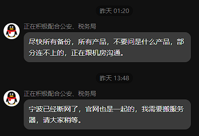

狐蒂云的初衷，并非是“让利用户”，而是通过“永久套餐”低价引流，吸引大量用户预付费，再用新用户的付费资金补贴老用户的服务成本，本质上是一种“庞氏骗局”式的运营模式。这种模式一旦无法吸引新用户入局，资金链就会立即断裂，最终走向倒闭跑路的结局。
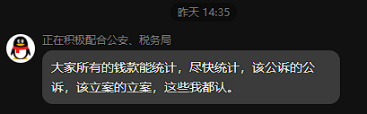
更值得警惕的是，狐蒂云在用户协议中埋下“陷阱”，虽然承诺“永久使用”，但同时标注“因不可抗力、政策调整、平台运营困难等原因，可终止服务，不承担额外赔偿”，这为其后续跑路留下了“法律漏洞”，用户即便起诉，也难以获得合理赔偿。
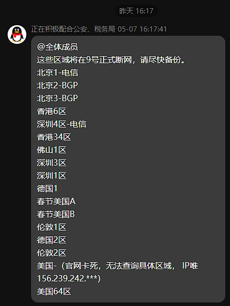

### （二）运营黑洞：超售、挪用资金，双重消耗资金链

除了违背商业逻辑的低价承诺，狐蒂云的违规运营，进一步加速了资金链的断裂，主要体现在两个方面：

一是严重超售，降低运营成本。为了减少服务器采购、机房租金等成本，狐蒂云大量超售虚拟机，一台正常只能承载30\-50台虚拟机的物理服务器，被违规开设200\+台虚拟机，导致服务器负载过高，频繁出现卡顿、宕机、丢包等问题，用户体验极差。即便如此，狐蒂云仍未停止超售，反而不断推出新的永久套餐，吸引更多用户付费，进一步加剧服务器压力。

二是挪用资金，填补亏损窟窿。狐蒂云将用户的预付费、二手主机交易资金，大量挪用至永久套餐的补贴、服务器采购、广告投放等方面，甚至被CEO个人挥霍。据用户统计，仅二手主机市场，就有超过千万资金被拖欠，用户提现一年未到账，而这些资金，本应属于用户的合法财产，却被平台违规挪用，成为压垮资金链的重要稻草。

### （三）行业根源：中小IDC低价内卷，监管缺失留隐患

狐蒂云的暴雷，也是国内中小IDC行业乱象的一个缩影。近年来，IDC行业门槛不断降低，大量小厂商涌入，行业竞争日益激烈，为了吸引用户，众多中小IDC厂商陷入“低价内卷”的死循环——不断降低价格、推出“永久套餐”“低价年付”等优惠，忽视运营成本和风险管控，最终陷入“入不敷出→资金链断裂→跑路”的困境。

同时，行业监管存在明显漏洞：部分中小IDC厂商未办理ICP备案、公安联网备案、IDC经营许可证等相关资质，属于“无资质运营”；部分厂商超售、挪用用户资金、虚假宣传等行为，缺乏有效的监管和处罚机制；用户的合法权益难以得到保障，一旦平台跑路，维权难度极大。

此外，IDC行业的盈利模式单一，大部分中小厂商仅依赖用户预付费，缺乏可持续的盈利路径，无法通过增值服务、技术升级等方式实现盈利，只能靠“拆东墙补西墙”维持运营，一旦预付费资金断裂，就会立即倒闭。

### （四）用户根源：贪便宜心理，忽视风险防范

这场悲剧的发生，也离不开用户自身的因素。很多用户被狐蒂云“1999元永久VPS”的低价所吸引，忽视了背后的风险，盲目付费，最终沦为“韭菜”。具体来看，用户的误区主要有三点：

一是贪便宜，违背“一分钱一分货”的原则。很多用户认为“一次付费，终身使用”非常划算，忽视了IDC服务的长期成本，误以为低价可以获得优质服务，却不知这是商家设置的陷阱；

二是缺乏风险意识，未核查平台资质。很多用户在购买服务前，未查询狐蒂云的工商信息、相关资质，也未了解平台的运营状况，盲目相信广告宣传，最终导致损失；

三是未做好数据备份，过度依赖单一服务商。很多用户将所有核心数据（网站源码、数据库、项目文件等）存储在狐蒂云服务器上，未进行异地备份，一旦服务器离线，数据就会彻底丢失，无法恢复。

## 四、用户损失全景：数据、资金、业务，三重毁灭性打击

狐蒂云的跑路，给数万用户带来了毁灭性的打击，无论是个人用户还是小型企业，都面临着数据、资金、业务的三重损失，很多用户多年的心血付诸东流，部分小型企业直接陷入破产危机。具体损失可分为以下四类：

### （一）数据损失：核心数据永久灭失，无法恢复

这是用户面临的最严重的损失之一。由于狐蒂云服务器全线下线，用户无法登录控制台、无法通过SSH连接服务器，无法备份任何数据，大量核心数据——包括个人站长的网站源码、数据库、文章素材，开发者的项目文件、代码，小型企业的客户数据、业务数据、财务数据等，全部永久灭失，无任何恢复可能。

有个人站长表示，自己运营了5年的博客，所有文章、粉丝数据都存储在狐蒂云服务器上，此次暴雷，5年心血全部归零；有开发者反馈，自己正在开发的项目，核心代码未备份，服务器离线后，项目彻底停滞，前期投入的时间、精力全部白费；有小型企业表示，公司的客户数据、订单数据全部丢失，无法联系客户，业务无法开展，直接面临破产。

### （二）资金损失：全额打水漂，退款无望

用户的资金损失主要集中在三个方面，且所有资金均无法追回：

一是永久VPS套餐费用：1999元/台的永久VPS，很多用户一次性购买多台，有用户反馈自己一次性购买了33台，花费近7万元，如今全部打水漂；

二是年付/季付套餐剩余费用：很多用户购买了年付、季付的VPS、虚拟主机等服务，还有数月甚至数年的剩余期限，这些剩余费用无法退还，平台承诺的“退款登记”只是一句空话；

三是二手主机交易资金：二手主机市场的交易资金“只进不出”，用户转售VPS获得的资金、充值的余额，无法提现，累计拖欠资金超过千万元，用户维权无门。

据用户自发统计，此次狐蒂云暴雷，用户累计损失超过亿元，其中大部分是个人用户的血汗钱，部分小型企业的损失更是高达数十万元。

### （三）业务损失：业务全面瘫痪，品牌受损

对于依赖狐蒂云服务器的小型企业、个人站长而言，服务器离线意味着业务全面瘫痪，带来的间接损失远超直接的资金损失：

小型企业：依赖狐蒂云服务器的网站、APP、小程序、游戏等业务，突然无法访问，导致用户流失、订单取消、品牌形象受损，部分企业因无法恢复业务，直接宣布破产；

个人站长：运营的网站无法访问，粉丝流失、广告收入中断，多年积累的网站权重、流量全部归零，重新搭建网站需要投入大量的时间、资金；

开发者：项目无法正常运行，前期投入的研发成本、测试成本全部白费，若项目已签订合作协议，还需承担违约责任，进一步扩大损失。

### （四）维权损失：时间、精力、资金，多重消耗

为了追回损失，数万用户投入了大量的时间、精力、资金，但维权之路异常艰难，最终大多无果而终：

时间成本：用户需要收集证据、联系其他用户、组建维权群、前往派出所报警、提交起诉材料，整个过程耗时数月甚至数年；

精力成本：用户需要频繁沟通、跟进维权进度，还要应对平台失联、警方无法立案、法院流程漫长等问题，身心俱疲；

资金成本：部分用户为了起诉，需要支付律师费、诉讼费等费用，而这些费用，最终也可能因为无法执行财产而白白浪费。

## 五、行业警示：拒绝低价陷阱，守护自身权益，推动行业健康发展

狐蒂云的暴雷，不是第一个，也不会是最后一个。在IDC行业低价内卷的当下，这场悲剧给所有用户、从业者、监管部门都敲响了警钟，唯有正视问题、规避风险、规范运营，才能避免更多悲剧重演。

### （一）给用户：理性消费，做好风险防范，守护自身权益

1\.  拒绝贪便宜，远离“永久套餐”“超低价套餐”：牢记“天下没有免费的午餐”，IDC服务的成本是长期的，“永久服务”“超低价套餐”本质上是陷阱，不符合商业逻辑，最终必然暴雷；

2\.  选择正规服务商，核查资质：优先选择阿里云、腾讯云、华为云等头部厂商，或运营时间长、口碑好、有齐全资质（ICP备案、IDC经营许可证等）的中小服务商，避免选择无资质的黑厂商；

3\.  定期异地备份数据：无论选择哪家服务商，都要养成定期异地备份核心数据的习惯，可使用云备份、本地备份等多种方式，避免因服务器故障、平台跑路导致数据丢失；

4\.  谨慎预付费，降低风险：尽量选择月付、季付的付费方式，避免大额年付、永久付费，若确需年付，可先小金额试用，确认服务稳定后再长期付费；

5\.  留存证据，学会维权：购买服务时，留存好付款凭证、用户协议、宣传截图等证据，若平台出现异常，及时收集证据，联合其他用户维权，必要时通过法律途径维护自身权益。

### （二）给IDC从业者：摒弃低价内卷，合规运营，实现可持续发展

1\.  摒弃自杀式运营，拒绝低价陷阱：放弃“永久套餐”“超低价引流”的模式，根据运营成本合理定价，提供与价格匹配的服务，建立可持续的盈利路径；

2\.  合规运营，坚守底线：办理齐全相关资质，不超售虚拟机、不挪用用户资金、不虚假宣传，规范服务流程，保障用户的合法权益；

3\.  加强风险管控，保障资金链稳定：合理控制运营成本，避免盲目扩张，建立风险预警机制，预留充足的流动资金，防止资金链断裂；

4\.  提升服务质量，打造核心竞争力：通过技术升级、增值服务、优质售后等方式，提升用户体验，打造自身核心竞争力，摆脱低价内卷的困境，实现长期发展。

### （三）给监管部门：加强监管，完善机制，规范行业秩序

1\.  加强资质审核，严厉打击无资质运营：严格审核IDC服务商的资质，对无ICP备案、IDC经营许可证等资质的厂商，依法予以查处、取缔；

2\.  加强日常监管，规范运营行为：定期对IDC服务商进行检查，严厉打击超售、挪用用户资金、虚假宣传等违规行为，建立黑名单制度，对违规厂商进行公示、处罚；

3\.  完善维权机制，保障用户权益：建立便捷的用户维权通道，简化维权流程，加大对跑路厂商的追责力度，帮助用户追回损失；

4\.  引导行业自律，推动行业健康发展：引导IDC行业建立自律机制，规范行业竞争秩序，鼓励厂商提升服务质量、创新盈利模式，推动行业良性发展。
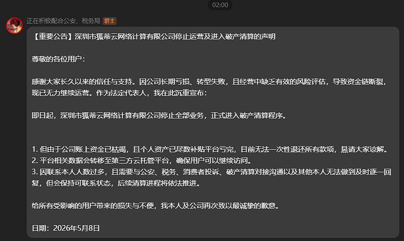

## 六、结语：低价的代价，是万丈深渊；理性的选择，才是长久之道

狐蒂云的暴雷，是一场由商家贪婪、行业内卷、用户贪便宜共同酿成的悲剧。它用数万用户的血泪损失，告诉我们一个简单而深刻的道理：天下没有免费的午餐，更没有永久的低价服务。

对于用户而言，一时的贪便宜，可能会导致终身的遗憾——数据丢失、资金白费、业务瘫痪，这些损失，往往难以挽回。理性消费、警惕风险、选择正规服务商、做好数据备份，才是保护自身权益的唯一途径。

对于IDC从业者而言，低价内卷没有赢家，违背商业逻辑的运营，最终只会走向倒闭。唯有摒弃贪婪、合规运营、提升服务质量，才能实现可持续发展，赢得用户的信任，推动行业的进步。

对于监管部门而言，加强监管、完善机制、规范行业秩序，才能遏制行业乱象，保护用户的合法权益，推动IDC行业健康、有序发展。

狐蒂云的故事，已经落下帷幕，但它留下的教训，值得每一个人铭记。愿所有用户都能吸取教训，远离低价陷阱；愿所有IDC从业者都能坚守底线，合规运营；愿IDC行业能摆脱内卷，走向良性发展，不再有更多的“狐蒂云悲剧”重演。

